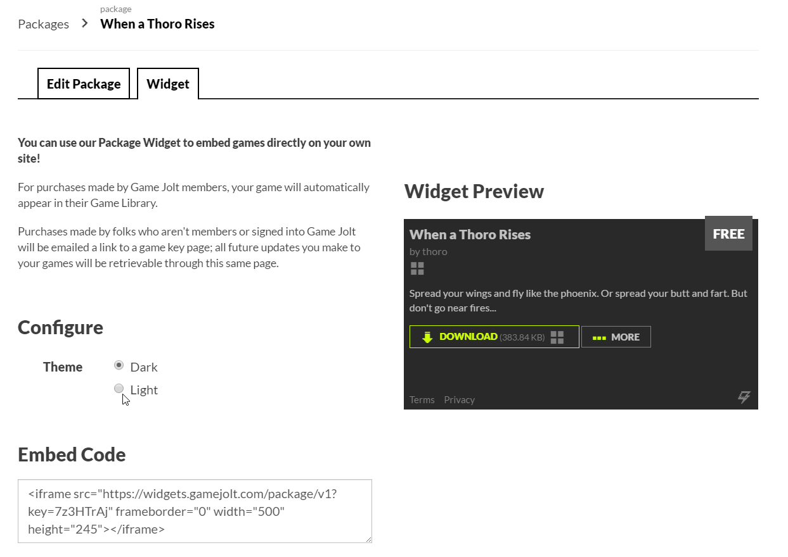

# Documentation

## Installing & Setup
1. Download via git or normal download.
2. Upload the content of your `humhub-gamejolt-module-master` to your server under `/protected/modules` and rename it `gamejolt`
3. Enable the module via `ACP --> Modules --> Modules List`
4. Go into your Gamejolt game manager then to packages, if you have a package uploaded you'll see a tab named widget under here you'll see the following URL copy it; `https://widgets.gamejolt.com//package/v1?key={package-id}` and follow the next step

5. In `ACP --> Gamejolt Settings` place your **Gamejolt** Widget URL in the configuration option then save and now you're done.
